# linkedin-agent

<p align="center">
  
</p>

Posts to LinkedIn automatically. Every Monday, 9am, done.

I got tired of the "I should post more" guilt loop. This runs on a cron job, calls Claude with a system prompt that matches your writing style, and publishes directly via the LinkedIn API. Takes maybe an hour to set up, then you forget about it.

Costs roughly $2-3/year to run.

---

## How it works

Each run follows a 3-tier topic selection:

1. **Trending Claude skill (~25% of runs)**: searches GitHub for recently created Claude Code skill repos gaining stars fast. If found, generates a teaser post and a local install guide in `skills/`.
2. **This week's real news**: searches DuckDuckGo News for a real cybersecurity or gaming incident from the past 7 days. Generic explainer articles are filtered out automatically.
3. **Static topic list (fallback)**: if no news is found, picks from your curated topic list, avoiding the last 5 used topics.

Then:

4. For technical or news topics, pulls 2 fresh sources via DuckDuckGo
5. Sends everything to Claude with your system prompt
6. Posts to LinkedIn
7. Saves to `history.json`

No database, no UI, no queue. Just a Python script.

---

## Setup

### 1. Clone and install

```bash
git clone https://github.com/joopinhontas/linkedin-agent.git
cd linkedin-agent
pip install -r requirements.txt
```

### 2. Create a LinkedIn app

Go to the [LinkedIn Developer Portal](https://www.linkedin.com/developers/apps/new) and create a new app.

In the app settings, under **Auth**:
- Add `http://localhost:8000/callback` as an authorized redirect URL
- Make sure these OAuth scopes are enabled: `openid`, `profile`, `w_member_social`

Copy your **Client ID** and **Client Secret**.

### 3. Get your access token

Copy `.env.example` to `.env` and fill in your LinkedIn app credentials:

```bash
cp .env.example .env
```

Then run the OAuth helper:

```bash
python oauth_helper.py
```

It opens a browser tab, you authorize the app, and it prints your `LINKEDIN_ACCESS_TOKEN` and `LINKEDIN_PERSON_URN`. Copy both into `.env`.

> Tokens expire after roughly 2 months. Just rerun `oauth_helper.py` when it stops working.

### 4. Get a Claude API key

Create an account at [console.anthropic.com](https://console.anthropic.com), generate an API key, and add it to `.env`.

### 5. Edit your `.env`

```env
ANTHROPIC_API_KEY=sk-ant-...
LINKEDIN_CLIENT_ID=your_client_id
LINKEDIN_CLIENT_SECRET=your_client_secret
LINKEDIN_ACCESS_TOKEN=AQX...
LINKEDIN_PERSON_URN=urn:li:person:...

# Optional — raises GitHub API rate limit from 60 to 5000 req/hour
GITHUB_TOKEN=

# Author info for auto-generated install guides
AUTHOR_NAME=Your Name
AUTHOR_TITLE=Your Job Title
AUTHOR_COMPANY=Your Company
WEBSITE_URL=https://yourwebsite.com
LINKEDIN_URL=https://linkedin.com/in/yourprofile
MALT_URL=                        # optional
GITHUB_URL=https://github.com/yourusername
```

### 6. Customize your system prompt

Open `prompts.py` and edit `SYSTEM_PROMPT`. Replace the `[PLACEHOLDERS]` with your actual information: your name, job title, skills, and how you write.

**This is the most important step.** The quality of the output depends entirely on how well you describe yourself here. Be specific about your expertise, mention real projects, and describe what you want to avoid (jargon, hollow phrases, etc.).

Also edit the `TOPICS` list to match your field. The default topics are DevOps/Cloud/Security oriented; swap them out if you work in a different domain.

### 7. Set up the cron job

```bash
crontab -e
```

Add this line (adjust the path):

```
0 9 * * 1 cd /path/to/linkedin-agent && /usr/bin/python3 agent.py >> agent.log 2>&1
```

This runs every Monday at 9am. Change `* * 1` to whatever schedule you want; [crontab.guru](https://crontab.guru) is handy for this.

---

## Manual post

To post immediately on a specific topic without waiting for the cron:

```bash
python post_now.py "zero trust architecture in practice"
```

It generates the post and asks for confirmation before publishing.

---

## Project structure

```
linkedin-agent/
├── agent.py          # main logic: topic selection, generation, publishing
├── prompts.py        # system prompt and topics list; edit these
├── oauth_helper.py   # one-time OAuth flow to get your access token
├── post_now.py       # manual post on demand
├── .env.example      # env template
├── history.json      # post history (auto-created, gitignored)
├── skills/           # auto-generated install guides (gitignored)
├── CHANGELOG.md      # version history
└── requirements.txt
```

---

## Notes

- `history.json` is gitignored. Don't delete it; it's how the agent avoids repeating itself.
- The model is set to `claude-opus-4-5` in `agent.py`. You can swap it for `claude-haiku-4-5` to cut costs further, though quality will vary.
- The DuckDuckGo source search is best-effort; if it fails, the post generates without sources.
- Posts are in whatever language you specify in your system prompt. The default topics are in English.

---

## Requirements

- Python 3.9+
- A LinkedIn account with a developer app (free)
- An Anthropic API key (~$2-3/year in usage)
